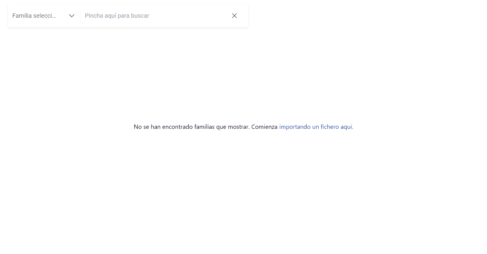

# Gent

Este es un proyecto surge por la lamentable desaparición de [Genoom](https://www.genoom.com/). Se trata de una visor de documentos [GEDCOM](https://es.wikipedia.org/wiki/GEDCOM). Surge como una alternativa libre y sencilla a las ya existentes.

Por último, me gustaría dedicar este proyecto a Virín. Gracias por todo, abuela, espero que te guste😊

## Instalación

Para la instalación del proyecto, es necesario descargar una de las versiones existentes y [disponibles en el repositorio](https://github.com/BorjaZarco/gent-app/releases). Tras la descarga, se debe de descomprimir el paquete para poder acceder a los ficheros que contienen el código y una build de la aplicación para dispositivos Windows.

Como se ha mencionado anteriormente, la distribución contiene únicamente una versión ejecutable para sistemas Windows. Lamentablemente, ha sido imposible generar una versión de la aplicación para Mac o Linux. No obstante, consulte la sección de ejecución local para poder ejecutarlo en dichos sistemas

## Ejecución local

Si se desea ejecutar el proyect(o de forma local es necesario tener instalado [NodeJS](https://nodejs.org/), para descargar las dependencias del proyecto listadas en el `package.json`. Para instalar dichas dependencias, es necesario ejecutar en la terminal del sistema el siguiente comando:

```
$ npm i
```

### Ejecución web

Para ejecutar el proyecto en web, basta con ejecutar el siguiente comando:

```
$ npm start
```

Esto compilará el proyecto angular y lo lanzará en un [servidor local](http://localhost:4200)

### Ejecución local

Para ejecutar el proyecto en electron, basta con ejecutar el siguiente comando:

```
$ npm run electron
```

Esto compilará el proyecto angular, generará un archivo ejecutable y lo lanzará localmente. Cuando termine el proceso, la aplicación aparecerá en pantalla automáticamente

## Uso

En el proceso de diseño de la interfaz de la aplicación se ha tenido muy en cuenta la experiencia del usuario. Por ello se ha hecho especial hincapié en la sencillez de la misma. Debido a esta sencillez, se considera que una pequeña guía visual bastará para mostrar todas las funcionalidades de la aplicación.



Para probar este proyecto se pueden descargar el archivo GEDCOM de prueba que se encuentra en [este repositorio](./public/demo.ged).

## Tecnologías

Se ha implementado el proyecto en [Angular](https://angular.io/) dado su gran potencial para crear aplicaciones web. Además, se ha empleado [Electron](https://www.electronjs.org/) para evitar el uso de servidores o bases de datos externas. Esta decisión viene motivada de la decisión de dejar el código completo del proyecto de forma visbile y libre. De esta manera, se evitan posibles brechas de seguridad que permitan el acceso a datos de diferentes usuarios de la aplicación. Además, permite que el proyecto sea usado libremente y adaptado a cualquier tecnolgía de forma fácil. El listado completo de dependencias se muestra a continuación:

- [Angular](https://angular.io/)
- [Electron](https://www.electronjs.org/)
- [PrimeNG](https://www.primefaces.org/primeng/)
- [TailwindCSS](https://tailwindcss.com/)
- [SweetAlert](https://sweetalert2.github.io/)

```

```
